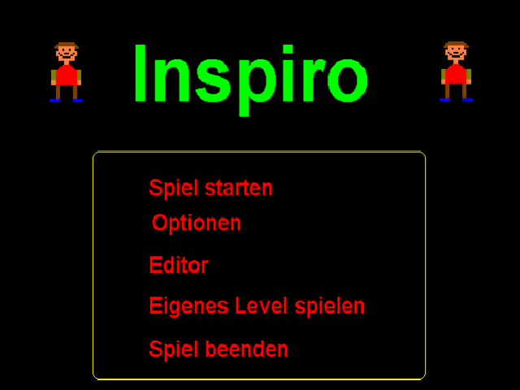
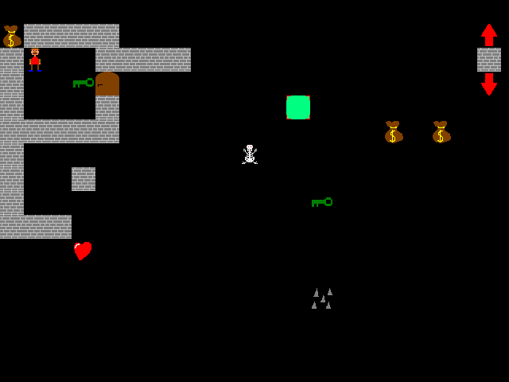
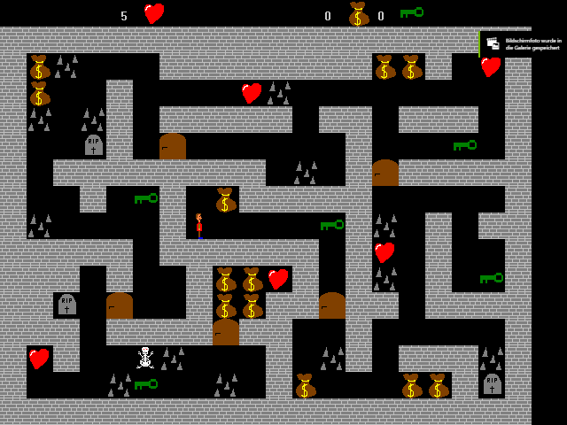
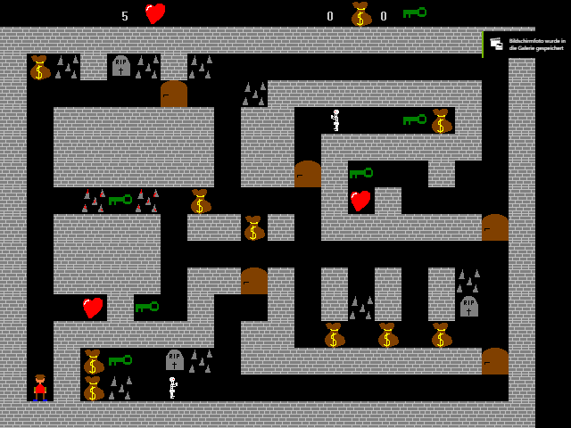
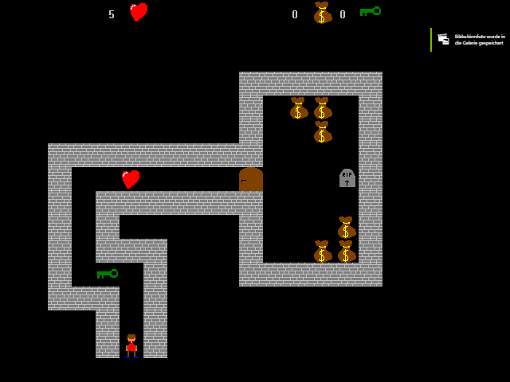
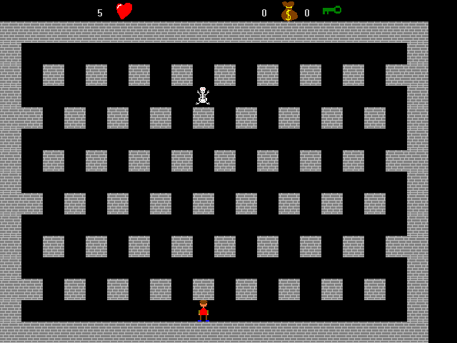

# Inspiro
An unfinished 2D game from 1999. Published in 2017 ;-).








## Controls

```
Up, Down, Left, Right: Move Inspiro
1-4: Select level
F1: Run editor
F2: Run level from editor
Enter: Place objects (only editor)
PageUp: Select object (only editor)
PageDown: Select object (only editor)
ESC: Leave level, editor or game
```

## Compilation under Windows

Open *Inspiro.sln* with Microsoft Visual Studio 2019.
